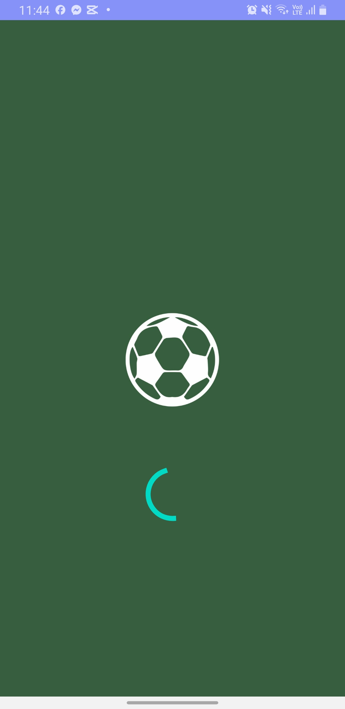
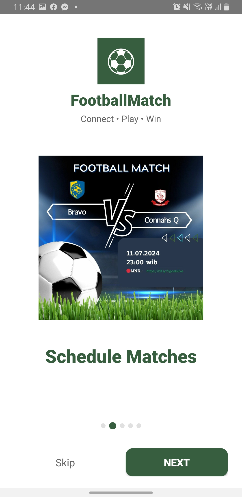
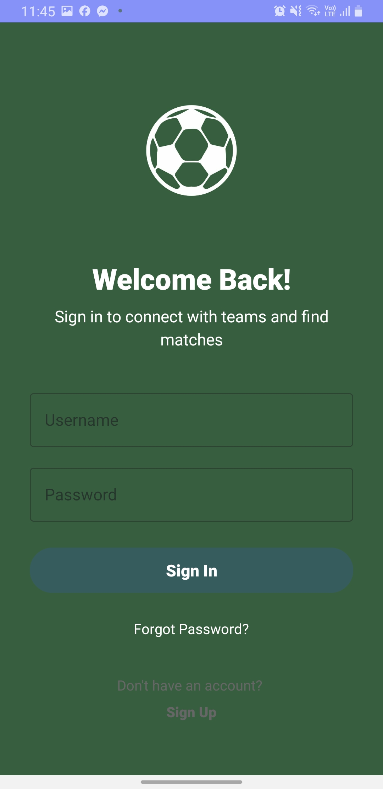
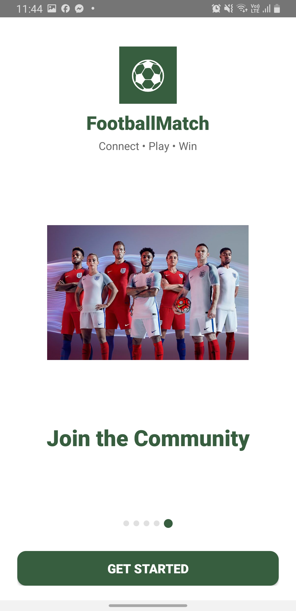
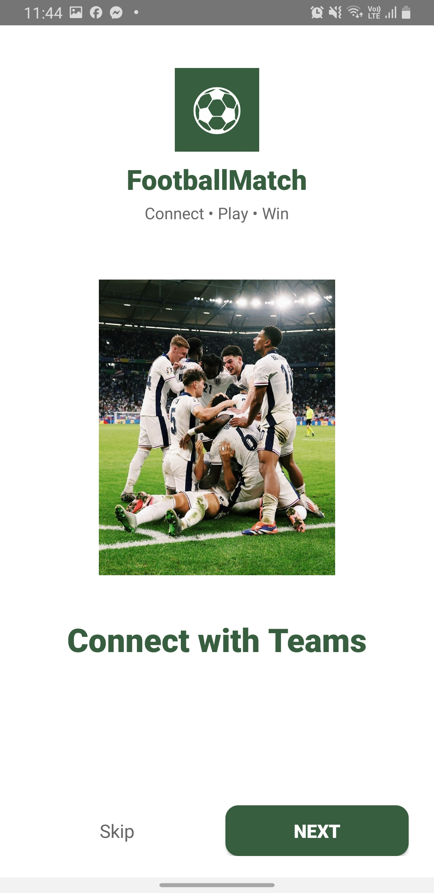
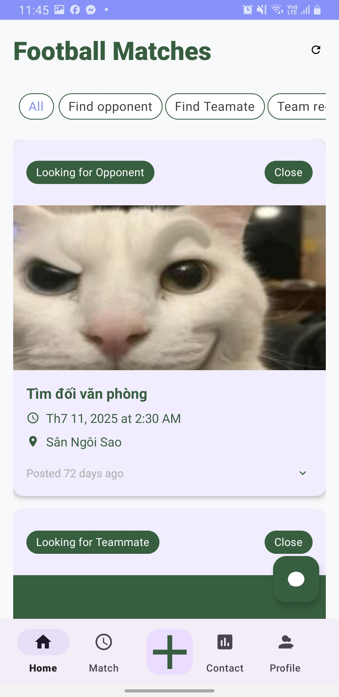
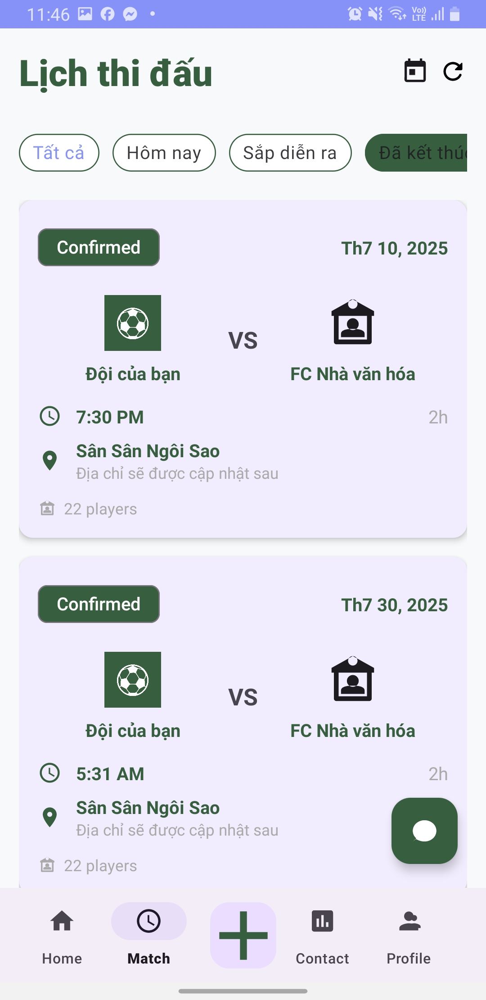
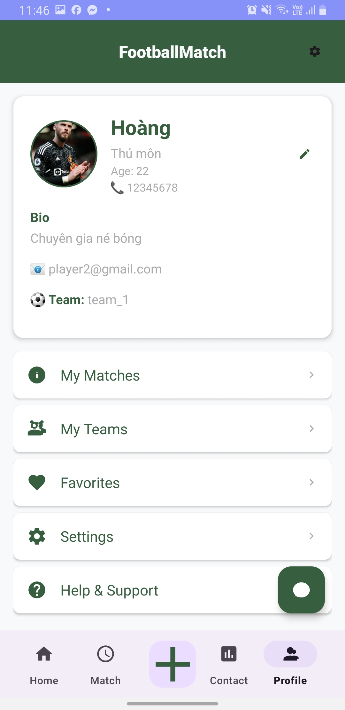
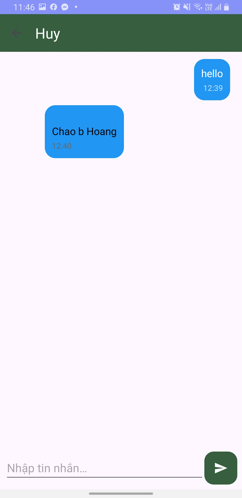
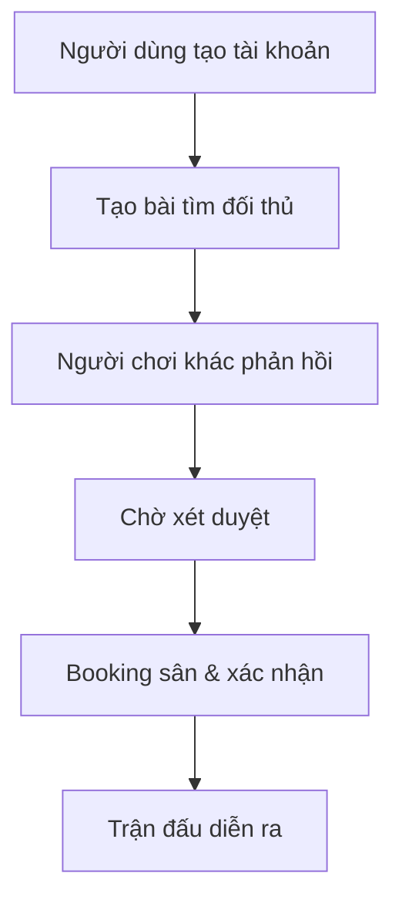

<h1 align="center">⚽ FMA - Football Match App</h1>

  
  
  
  

  <i>Kết nối đam mê - Đặt sân dễ dàng - Giao lưu bóng đá khắp nơi</i> 
  <strong>FMA</strong> là nền tảng Android App giúp người dùng tạo yêu cầu tìm đối thủ, đặt sân, và tương tác với cộng đồng bóng đá dễ dàng.

# Screenshots

---

## 🏁 Mục tiêu của ứng dụng

FMA hướng tới việc trở thành nền tảng **kết nối người chơi bóng đá phong trào**, giúp bạn:
- Tìm đối thủ phù hợp & đặt lịch nhanh chóng.
- Quản lý đội bóng & thành viên hiệu quả.
- Cập nhật thông tin sân bãi, bản đồ dễ dàng.
- Giao tiếp với cộng đồng đam mê bóng đá.

---

## 🌟 Tính năng nổi bật
--------------------------------------------------------------------------------------------------------------

| Tính năng                    | Mô tả                                                                       |
|------------------------------|-----------------------------------------------------------------------------|
| 📝 **Tạo bài đăng trận đấu** | Người dùng đăng bài tìm đối thủ, chọn thời gian và sân bóng.                |
| 🔄 **Phản hồi bài đăng**     | Người chơi khác có thể phản hồi bài đăng để yêu cầu đá giao lưu.            |
| ✅ **Duyệt & Booking trận**  | Quản trị viên hoặc người đăng có thể xét duyệt và xác nhận đặt sân.         |
| 🏟️ **Kết nối sân bóng**      | Ứng dụng lấy thông tin sân từ Firebase và hiển thị bản đồ bằng Google Maps. |
| 👥 **Quản lý đội bóng**      | Người dùng có thể tạo team, thêm thành viên, sắp xếp đội hình, nhắn tin...  |
| 🗺️ **Google Maps API**       | Hiển thị địa điểm sân bóng, chỉ đường tiện lợi.                             |
| 🔥 **Firebase Realtime**     | Đồng bộ dữ liệu thời gian thực, bảo mật và nhanh chóng.                     |
| 📲 **RecyclerView UI**       | Giao diện danh sách mượt mà, tối ưu hóa trải nghiệm người dùng.             |

--------------------------------------------------------------------------------------------------------------

## 🧭 Luồng hoạt động

## 📱 Ảnh minh hoạ (Screenshots)

> 

---

-------------------------------------------------------------

## 📡 Công nghệ sử dụng
-------------------------------------------------------------

| Công nghệ            | Mô tả                              |
|----------------------|------------------------------------|
| Android Studio       | Nền tảng phát triển chính          |
| Java                 | Ngôn ngữ lập trình                 |
| Firebase Realtime DB | Lưu trữ dữ liệu thời gian thực     |
| Firebase Auth        | Xác thực người dùng                |
| Google Maps SDK      | Hiển thị bản đồ, tìm kiếm sân bóng |
| RecyclerView         | Tối ưu danh sách hiển thị UI       |

-------------------------------------------------------------

> Made with ❤️ by Football Lovers — FMA Team
